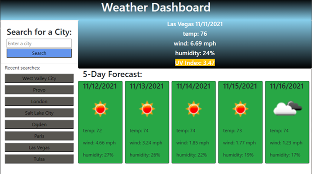

# Weather Dashboard

  ## Description:
  Find the current weather of a given city along with a 5 day forecast and a UV index.  All searches are saved on the local storage and buttons is displayed for a quick search of all saved cities.

  ## Demo:
   

  ## Built with:
  HTML, CSS, and Javascript

  ## Website:
  https://github.com/johnrip89/Weather-Dashboard/
  
  https://johnrip89.github.io/Weather-Dashboard/

  ## Contribution:
  Made by John Ripplinger